# Case Study: DICOM PACS Automatic Routing, Failure Diagnosis, and Transaction Recovery

## Healthcare Imaging Interoperability Lab

## Executive Summary

This case study documents a hands-on Picture Archiving and Communication System (PACS) exercise involving Digital Imaging and Communications in Medicine (DICOM) storage, query/retrieve, metadata inspection, destination management, automatic routing, controlled failure injection, troubleshooting, and recovery.

The objective was to move beyond testing isolated DICOM commands and instead operate the environment as a small imaging workflow.

The exercise progressed through:

1. PACS operational validation
2. DICOM study and metadata inspection
3. Query/retrieve testing
4. Manual DICOM routing
5. Metadata-driven automatic routing
6. Positive and negative routing controls
7. Intentional downstream destination failure
8. PACS job and network-level diagnosis
9. Destination restoration
10. Failed transaction recovery

All patient and imaging data shown in this lab are synthetic test data created specifically for interoperability testing.


---

## 1. PACS Operational Baseline

Orthanc was deployed as the PACS/DICOM server for the lab.

Before exercising routing behavior, the PACS was inspected manually to establish that the imaging study was present and that its identifying metadata was visible through the operator interface.

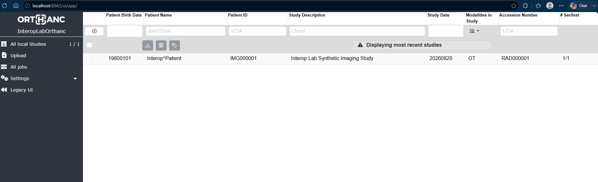

**Figure 1 — PACS operational baseline.**  
Orthanc contains the synthetic imaging study used throughout the interoperability exercises.


---

## 2. DICOM Study and Metadata Inspection

The stored DICOM object was inspected at the metadata level.

The examination included identifiers and attributes such as:

- Patient ID
- Patient Name
- Accession Number
- Study Description
- Modality
- Study Instance Unique Identifier (UID)
- Series Instance UID
- Service-Object Pair (SOP) Instance UID
- Transfer Syntax
- Study/Series/Instance hierarchy

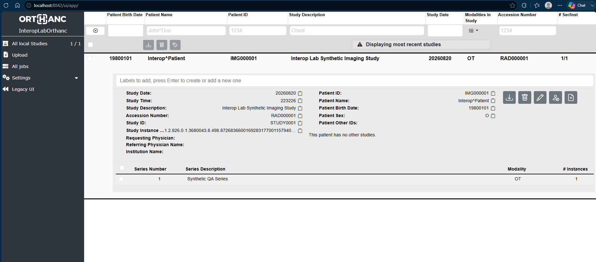

**Figure 2 — Stored DICOM metadata and hierarchy.**  
Manual inspection exposes the identifiers required to trace an imaging object through the PACS.


---

## 3. Source-to-PACS Reconciliation

The DICOM source object was compared with the object stored by Orthanc.

This provided a basic reconciliation control to verify that important identifying information remained consistent after ingestion.

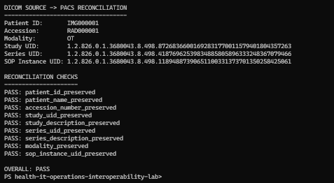

**Figure 3 — Source-to-PACS reconciliation.**  
Automated validation confirms consistency between the generated DICOM object and the PACS representation.


---

## 4. DICOM Query/Retrieve Validation

The lab exercised DICOM query/retrieve behavior rather than relying exclusively on the Orthanc graphical interface.

DICOM C-FIND was used to test query behavior and Application Entity (AE) authorization.

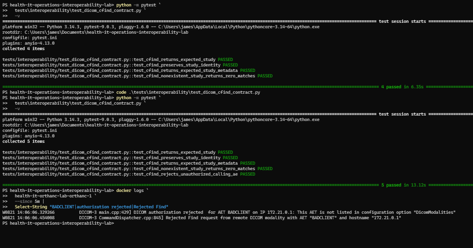

**Figure 4 — C-FIND authorization behavior.**  
The test distinguishes accepted query behavior from an unauthorized Application Entity condition.

A DICOM Storage Service Class Provider (SCP) was also established on TCP port 11112 to receive retrieved or routed objects.

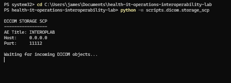

**Figure 5 — DICOM Storage SCP listening on TCP port 11112.**  
The receiving endpoint provides independent downstream evidence of DICOM delivery.


---

## 5. C-MOVE Retrieval

DICOM C-MOVE was exercised against the PACS.

A successful retrieval resulted in the requested imaging object being delivered to the Storage SCP.

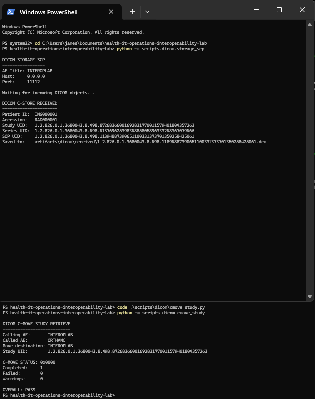

**Figure 6 — Successful C-MOVE and downstream C-STORE receipt.**  
The PACS retrieval operation results in delivery of the DICOM object to the configured destination.

The retrieved object was subsequently validated for identity consistency.

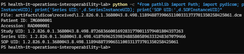

**Figure 7 — Retrieved-object identity validation.**  
Patient and imaging identifiers are checked after retrieval rather than treating successful transport alone as sufficient evidence.


---

## 6. Automated C-MOVE Contract Testing

The manual workflow was converted into repeatable automated tests.

The C-MOVE contract suite validated:

- successful retrieval
- preservation of patient identity
- preservation of DICOM hierarchy
- rejection of an unknown study

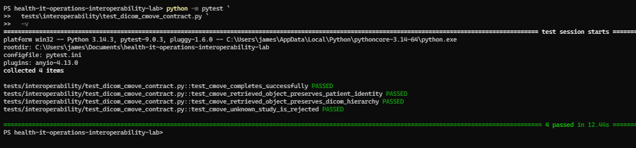

**Figure 8 — Automated DICOM C-MOVE contract suite.**  
Four retrieval and integrity behaviors execute successfully under pytest.

Failure behavior was also tested by attempting retrieval when the requested destination was unavailable.

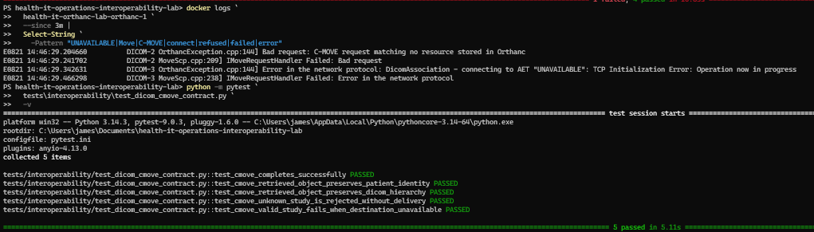

**Figure 9 — C-MOVE unavailable-destination testing.**  
The test suite and PACS logs demonstrate expected failure behavior when the receiving DICOM endpoint cannot be reached.


---

## 7. Manual PACS Operation

After protocol-level testing, the workflow was deliberately exercised through the PACS operator interface.

The study detail screen was used to inspect the patient, study, series, and instance information.

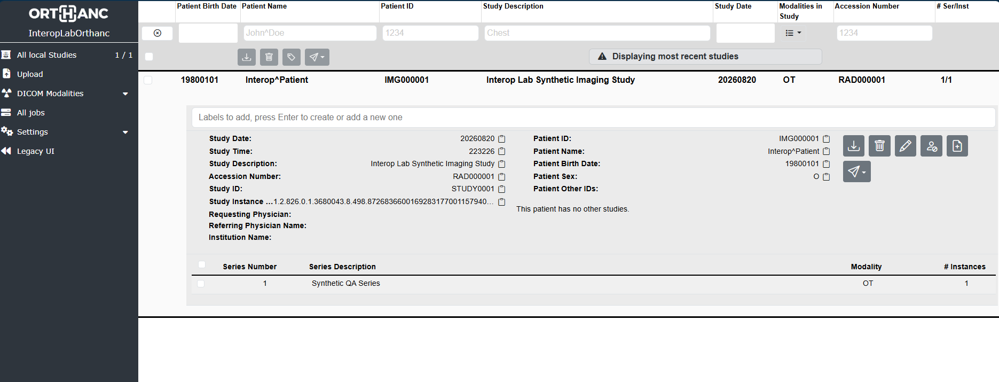

**Figure 10 — Manual PACS study inspection.**

The configured DICOM destinations were then inspected.

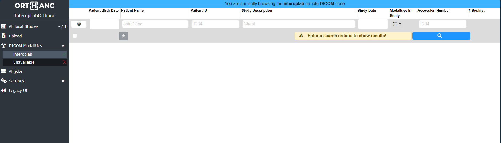

**Figure 11 — Configured remote DICOM destinations.**  
The interface distinguishes the reachable INTEROPLAB destination from the deliberately unavailable test destination.


---

## 8. Study/Series/Instance Hierarchy

The DICOM hierarchy was expanded manually.

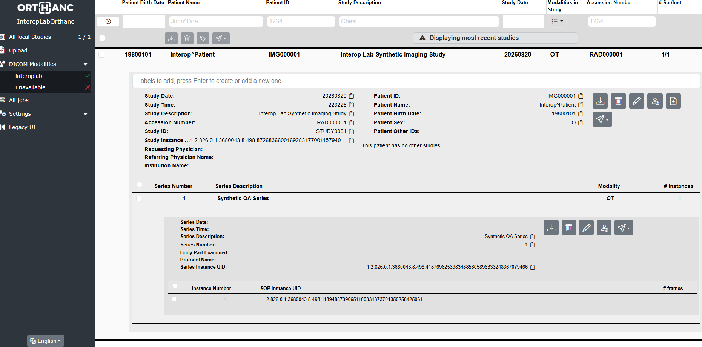

**Figure 12 — DICOM Study/Series/Instance hierarchy.**  
The operator view exposes the relationship between the imaging study, its series, and the individual SOP Instance.


---

## 9. Manual DICOM Routing

A study was manually selected for transmission to a configured DICOM destination.

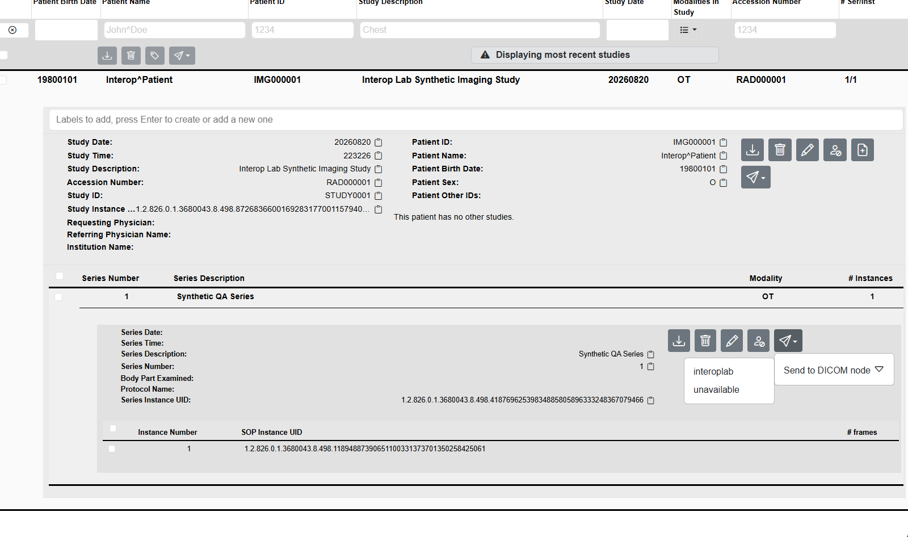

**Figure 13 — Manual selection of a DICOM destination.**

The transfer to the healthy INTEROPLAB destination completed successfully.

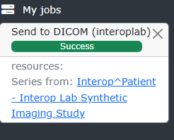

**Figure 14 — Successful manually initiated DICOM transmission.**

The downstream Storage SCP independently confirmed receipt.

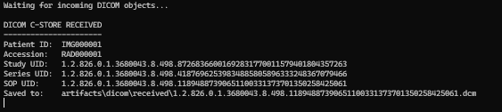

**Figure 15 — Independent downstream C-STORE receipt.**  
This provides evidence beyond the PACS user interface that the object actually reached the receiving DICOM application.


---

## 10. Successful and Failed Destination Behavior

The same workflow was exercised against both healthy and unavailable destinations.

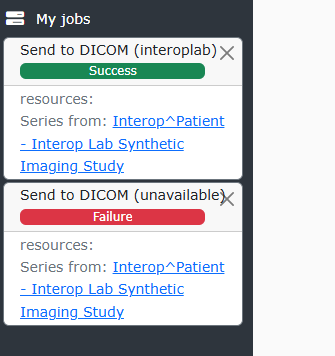

**Figure 16 — PACS job comparison showing successful and failed DICOM delivery.**

This established an important operational distinction:

> A DICOM object can be valid and correctly selected for transmission while delivery still fails because the downstream destination is unavailable.


---

# Metadata-Driven Automatic Routing

## 11. Routing Rule

A Lua-based routing rule was introduced to automatically route incoming DICOM objects according to metadata.

The controlled routing condition was:

```text
Accession Number = RADROUTE001
        |
        v
Route to INTEROPLAB
```

A nonmatching accession was used as the negative control:

```text
Accession Number = RADNOROUTE001
        |
        v
Do not automatically route
```


---

## 12. Successful Automatic Routing

A synthetic DICOM object containing:

```text
Patient ID:       IMGROUTE001
Accession Number: RADROUTE001
```

was transmitted into Orthanc.

The routing callback evaluated the object's metadata and selected INTEROPLAB.

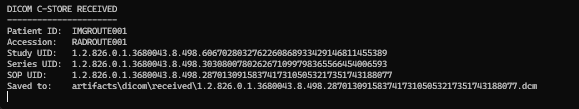

**Figure 17 — Metadata-driven automatic route selection.**  
The PACS identifies the matching accession number and selects INTEROPLAB without manual operator routing.

The automatic routing operation completed successfully.

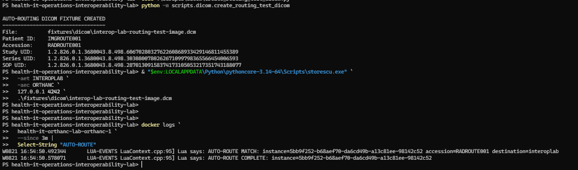

**Figure 18 — Successful PACS automatic routing operation.**

The downstream receiver independently confirmed C-STORE receipt.


**Figure 19 — Downstream receipt of automatically routed DICOM object.**


---

## 13. Positive and Negative Routing Controls

Automatic routing was tested with both matching and nonmatching metadata.

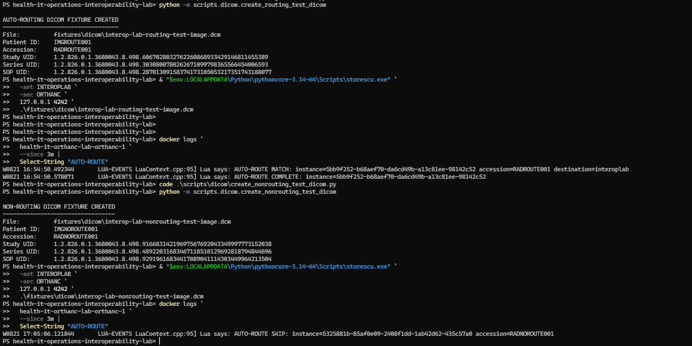

**Figure 20 — Positive and negative automatic-routing controls.**

Observed behavior:

```text
RADROUTE001
    |
    +--> AUTO-ROUTE MATCH
            |
            +--> INTEROPLAB

RADNOROUTE001
    |
    +--> AUTO-ROUTE SKIP
```

This demonstrated that automatic delivery was driven by the defined metadata condition rather than indiscriminately forwarding every received object.


---

# Controlled Failure Exercise

## 14. Failure Injection

The INTEROPLAB Storage SCP was deliberately stopped.

This created a controlled downstream outage while leaving Orthanc operational.

The expected condition became:

```text
Orthanc
   |
   | automatic route
   v
INTEROPLAB
   X
TCP 11112 unavailable
```

A fresh DICOM object containing the matching Accession Number `RADROUTE001` was then C-STORE'd into Orthanc.


---

## 15. Route Selection Still Succeeds

Orthanc accepted the incoming DICOM object and correctly evaluated its metadata.

The log showed:

```text
AUTO-ROUTE MATCH
accession=RADROUTE001
destination=interoplab
```

The routing rule itself was therefore functioning.

However, the downstream receiver was unavailable.


---

## 16. Automatic Delivery Failure

Orthanc attempted to establish the downstream DICOM association and reported:

```text
Error in the network protocol

DicomAssociation - connecting to AET "INTEROPLAB":
TCP Initialization Error
```

The background job subsequently reported that the DICOM object could not be sent to INTEROPLAB.

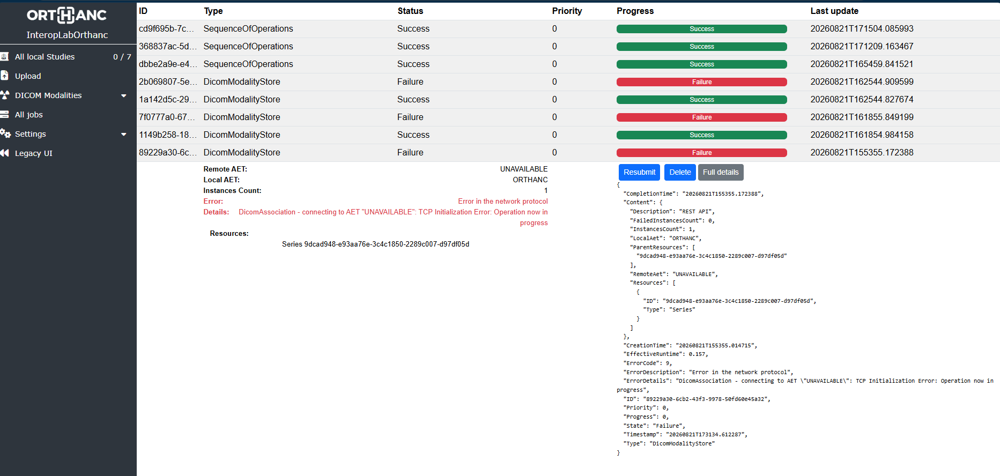

**Figure 21 — Controlled INTEROPLAB destination outage.**

The PACS job provided additional failure evidence.

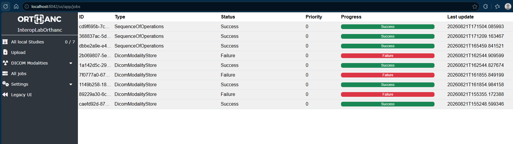

**Figure 22 — Failed automatic DICOM delivery after successful route selection.**

Detailed inspection identified the failed destination and network protocol condition.


**Figure 23 — Automatic-routing job failure detail.**  
The PACS identifies the intended remote Application Entity Title (AET) and the network-level association failure.


---

## 17. Important Operational Finding

During the exercise, the Lua log produced:

```text
AUTO-ROUTE COMPLETE
```

before downstream delivery had actually succeeded.

The subsequent Orthanc background job failed.

Therefore:

```text
AUTO-ROUTE COMPLETE
        !=
DICOM DELIVERY SUCCESS
```

Instead, the observed lifecycle was:

```text
routing condition evaluated
        |
        v
destination selected
        |
        v
background job created
        |
        v
DICOM association attempted
        |
        v
actual delivery result determined
```

This means PACS troubleshooting cannot rely exclusively on the routing-rule log.

The background job and downstream receiving system must also be inspected.


---

# Diagnosis

## 18. Multi-Layer Troubleshooting

The failure was investigated at multiple layers.

### PACS Layer

The Orthanc job showed that the correct destination had been selected but delivery failed.

### Network Layer

TCP port 11112 was tested while the Storage SCP was unavailable.

The connection failed as expected.

### DICOM Layer

DICOM C-ECHO was used to test Application Entity connectivity.

### Application Log Layer

Orthanc logs correlated:

```text
incoming DICOM object
        |
        v
routing-rule match
        |
        v
destination selection
        |
        v
background delivery job
        |
        v
association failure
```

The evidence localized the failure to downstream destination availability rather than:

- source-object generation
- PACS ingestion
- metadata extraction
- routing-rule evaluation
- destination selection


---

# Recovery

## 19. Restore the Downstream Receiver

The INTEROPLAB Storage SCP was restarted.

TCP connectivity was then rechecked.

Observed result:

```text
RemoteAddress    : 127.0.0.1
RemotePort       : 11112
TcpTestSucceeded : True
```

DICOM connectivity was subsequently revalidated using C-ECHO.


---

## 20. Recover the Original Transaction

Rather than creating a new DICOM object and repeating the workflow, the failed PACS operation was resubmitted.

The original Orthanc job:

```text
7a1513b1-b835-4ee6-9a74-a57e3b3421f5
```

transitioned to:

```text
Status:           Success
ErrorCode:        0
ErrorDescription: Success
```

<!-- Add final recovery screenshot here after saving it:
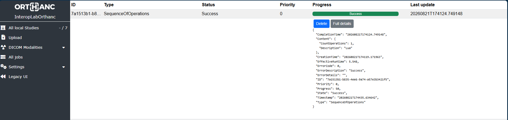

**Figure 24 — Successful recovery of the original failed automatic-routing operation.**
-->


---

# End-to-End Incident Timeline

```text
Synthetic DICOM object
        |
        v
C-STORE
        |
        v
Orthanc accepts object
        |
        v
Accession Number evaluated
        |
        v
RADROUTE001 MATCH
        |
        v
INTEROPLAB selected
        |
        v
background routing job
        |
        v
destination unavailable
        |
        X
DICOM association failure
        |
        v
PACS job FAILURE
        |
        v
operator investigates
        |
        +--> PACS job
        |
        +--> Orthanc logs
        |
        +--> TCP 11112
        |
        +--> DICOM C-ECHO
        |
        v
Storage SCP restored
        |
        v
TCP connectivity restored
        |
        v
DICOM connectivity verified
        |
        v
failed job resubmitted
        |
        v
original job SUCCESS
```


---

# Manual Operation and Automated Testing

The lab intentionally combines manual system operation with automated interoperability testing.

The manual workflow provides experience with:

- PACS navigation
- patient and study lookup
- DICOM metadata inspection
- Study/Series/Instance hierarchy
- remote DICOM destinations
- manual routing
- PACS job monitoring
- failure inspection
- resubmission and recovery

The automated layer provides repeatable validation of:

- DICOM C-FIND behavior
- DICOM C-MOVE behavior
- C-STORE receipt
- patient identity preservation
- DICOM hierarchy preservation
- unavailable-destination handling
- metadata-driven routing
- positive routing conditions
- negative routing conditions
- PACS reconciliation

Together these provide two complementary perspectives:

```text
              PACS WORKFLOW
                   |
          +--------+--------+
          |                 |
          v                 v
   OPERATOR VIEW       TESTER VIEW
          |                 |
          v                 v
 inspect workflow      define contract
 inspect jobs          automate checks
 diagnose failure      inject failures
 restore service       validate behavior
 verify recovery       prevent regression
```


---

# Skills Demonstrated

This case study provides practical evidence of exposure to and hands-on use of:

- Picture Archiving and Communication Systems (PACS)
- Digital Imaging and Communications in Medicine (DICOM)
- DICOM Application Entity (AE) configuration
- Application Entity Titles (AET)
- DICOM C-ECHO
- DICOM C-STORE
- DICOM C-FIND
- DICOM C-MOVE
- Service Class User (SCU)
- Service Class Provider (SCP)
- Study/Series/Instance hierarchy
- DICOM metadata inspection
- Accession Number-based routing
- PACS destination configuration
- PACS job monitoring
- failed-job investigation
- transaction resubmission
- network and application-layer troubleshooting
- controlled failure injection
- negative testing
- interoperability contract testing
- Python
- pytest
- DCMTK
- Orthanc
- Docker
- PowerShell
- operational documentation


---

# Conclusion

This exercise demonstrates a testing-first approach to healthcare imaging interoperability while simultaneously developing practical PACS operational knowledge.

The workflow was not limited to demonstrating that DICOM commands could execute successfully.

Instead, the imaging transaction was followed across its operational lifecycle:

```text
ingestion
   ->
metadata inspection
   ->
query/retrieve
   ->
routing
   ->
downstream delivery
   ->
failure
   ->
diagnosis
   ->
service restoration
   ->
transaction recovery
```

The combination of manual PACS operation, protocol-level testing, metadata validation, automated contract testing, controlled failure injection, job analysis, network troubleshooting, and recovery verification demonstrates an ability to reason about healthcare imaging workflows across application and infrastructure boundaries.

