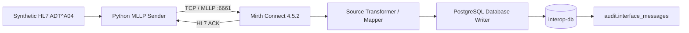
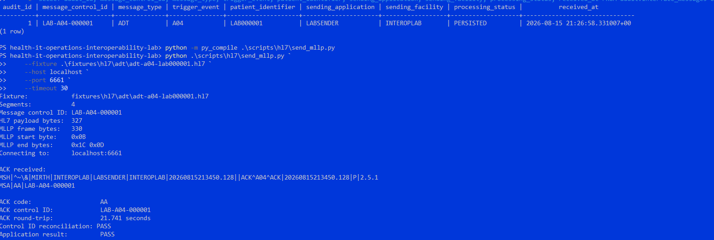

# HL7 ADT^A04 Downstream Dependency Failure and Recovery Validation

**Project:** Healthcare IT Operations & Interoperability Lab
**Validation date:** 2026-08-15
**Status:** PASS
**Data classification:** Synthetic test data only; no PHI

## Executive Summary

This validation evaluates transaction integrity across an HL7 v2 interface when a downstream persistence dependency becomes unavailable and is subsequently restored.

A synthetic `ADT^A04` message was transmitted over MLLP to Mirth Connect 4.5.2. Under normal conditions, Mirth transformed selected HL7 fields, persisted transaction metadata to a dedicated PostgreSQL audit database, and returned an `AA` acknowledgment correlated to the inbound `MSH-10`.

The downstream `interop-db` service was then intentionally stopped while Mirth and its internal database remained operational. A uniquely identified ADT transaction was submitted during the outage. Mirth returned `AE`, preserved correct message-control-ID correlation in `MSA-2`, and the sender returned a non-zero application-failure exit code. After the database was restored, direct SQL verification confirmed that the failed transaction had not been persisted.

A new recovery transaction was then submitted. It received `AA` and was persisted successfully with the expected patient identifier and processing status.

The test demonstrates that the interface distinguishes transport receipt from downstream application success, propagates a downstream processing failure to the sender, preserves transaction correlation, avoids false persistence evidence, and recovers after restoration of the failed dependency.

---

## Validation Objectives

The validation was designed to answer the following questions:

1. Does a healthy HL7 transaction persist successfully and return `AA`?
2. If the downstream audit database is unavailable while Mirth remains reachable, does the interface avoid returning a false-success `AA`?
3. Does the failure acknowledgment remain correlated to the original `MSH-10`?
4. Does a failed transaction remain absent from the audit persistence layer?
5. After the database dependency is restored, does the interface recover without requiring a Mirth restart?
6. Is the recovered transaction both acknowledged and persisted correctly?

---

## Architecture Under Test



The integration audit database is intentionally separate from Mirth's own PostgreSQL database:

- `mirth-db` supports Mirth Connect itself.
- `interop-db` stores integration transaction evidence used by the lab.
- `audit.interface_messages` stores selected message metadata, including message control ID, message type, trigger event, patient identifier, sending application, sending facility, processing status, and receipt timestamp.

This separation allowed the audit persistence dependency to be failed independently while leaving Mirth available to receive HL7 traffic.

---

## Reproducible Configuration

The active Mirth channel is exported and source-controlled at:

```text
infrastructure/mirth/channels/ADT_A04_IN.xml
```

The exported channel contains the TCP Listener, HL7 v2 processing configuration, source mappings, PostgreSQL Database Writer, and ACK behavior.

The committed database connection configuration is sanitized:

```xml
<url>jdbc:postgresql://interop-db:5432/interop</url>
<username>interop_app</username>
<password>REPLACE_WITH_LOCAL_SECRET</password>
```

Relevant repository commits:

```text
f2c6466  Add HL7 audit persistence and automated reconciliation
72c64ae  Add reproducible Mirth ADT channel configuration
```

The live database credential is maintained outside source control.

---

## Baseline Transaction

Before inducing failure, the channel was validated under normal operating conditions.

### Source transaction

```text
Message control ID: LAB-A04-000001
Segments:           4
HL7 payload bytes:  327
MLLP frame bytes:   330
Target:             localhost:6661
```

### Mirth acknowledgment

```hl7
MSH|^~\&|MIRTH|INTEROPLAB|LABSENDER|INTEROPLAB|20260815225630.563||ACK^A04^ACK|20260815225630.563|P|2.5.1
MSA|AA|LAB-A04-000001
```

### Sender result

```text
ACK code:                   AA
ACK control ID:             LAB-A04-000001
ACK round-trip:             4.919 seconds
Control ID reconciliation: PASS
Application result:         PASS
```

### Result

The baseline transaction met the expected success contract:

```text
MSH-10 = LAB-A04-000001
MSA-1  = AA
MSA-2  = LAB-A04-000001
```

The acknowledgment was both successful and correlated to the correct inbound transaction.

---

## Controlled Downstream Failure

A unique transaction ID was generated for the outage scenario:

```text
LAB-A04-FAIL-20260815185931
```

A temporary fixture was created from the deterministic ADT fixture by replacing the message control ID. The source-controlled fixture was not modified.

The downstream integration database was then intentionally stopped:

```text
Container health-it-mirth-lab-interop-db-1 Stopped
```

At the time of the test, Mirth and its internal database remained operational:

```text
health-it-mirth-lab-mirth-1      Up
health-it-mirth-lab-mirth-db-1   Up (healthy)
```

Mirth continued listening on the expected ports, including MLLP on `6661/tcp`.

This isolated the failure condition to the downstream audit database rather than the interface engine or transport endpoint.

---

## Failure-Path Transaction Evidence

### Source transaction

```text
Message control ID: LAB-A04-FAIL-20260815185931
Segments:           4
HL7 payload bytes:  340
MLLP frame bytes:   343
Target:             localhost:6661
```

### Mirth acknowledgment

```hl7
MSH|^~\&|MIRTH|INTEROPLAB|LABSENDER|INTEROPLAB|20260815230103.890||ACK^A04^ACK|20260815230103.890|P|2.5.1
MSA|AE|LAB-A04-FAIL-20260815185931|An Error Occurred Processing Message.
```

### Sender result

```text
ACK code:                   AE
ACK control ID:             LAB-A04-FAIL-20260815185931
ACK round-trip:             20.239 seconds
Control ID reconciliation: PASS
Application result:         FAIL (ACK code AE)
Sender exit code:           3
```

### Finding F-01 — Downstream failure propagated to the sender

Mirth remained reachable and received the transaction, but the unavailable Database Writer dependency prevented successful downstream completion. The interface returned `AE` rather than `AA`.

This confirms that successful transport to Mirth was not treated as equivalent to successful application processing.

### Finding F-02 — Transaction correlation was preserved during failure

The failure response retained:

```text
MSA-2 = LAB-A04-FAIL-20260815185931
```

which matched the inbound `MSH-10`.

The sender therefore distinguished two independent assertions:

```text
Control ID reconciliation: PASS
Application result:         FAIL (ACK code AE)
```

A correctly correlated ACK did not cause the sender to classify the failed application transaction as successful.

### Finding F-03 — Failure was machine-detectable

The sender returned:

```text
exit code 3
```

for the `AE` condition.

This allows the application-level failure to be detected by an automated test runner, CI process, or external orchestration without parsing human-readable console text alone.

---

## Persistence Verification for the Failed Transaction

After `interop-db` was restored, the failed message control ID was queried directly:

```sql
SELECT COUNT(*)
FROM audit.interface_messages
WHERE message_control_id = 'LAB-A04-FAIL-20260815185931';
```

Result:

```text
count
-----
0
```

### Finding F-04 — No false persistence record was created

The failed transaction was absent from `audit.interface_messages`.

The externally visible HL7 result and the downstream persistence state were therefore consistent:

```text
HL7 application result: AE
Audit persistence:      no row
```

---

## Recovery Validation

After the database service was restored, a second unique transaction was generated:

```text
LAB-A04-RECOVERY-20260815190355
```

Mirth was not restarted as part of the recovery sequence.

### Recovery acknowledgment

```hl7
MSH|^~\&|MIRTH|INTEROPLAB|LABSENDER|INTEROPLAB|20260815230411.149||ACK^A04^ACK|20260815230411.149|P|2.5.1
MSA|AA|LAB-A04-RECOVERY-20260815190355
```

### Sender result

```text
ACK code:                   AA
ACK control ID:             LAB-A04-RECOVERY-20260815190355
ACK round-trip:             0.531 seconds
Control ID reconciliation: PASS
Application result:         PASS
Sender exit code:           0
```

### Finding F-05 — Interface processing recovered after dependency restoration

After `interop-db` returned, a new transaction completed successfully and received `AA` without restarting Mirth.

---

## Recovery Persistence Evidence

The recovery transaction was queried directly from `audit.interface_messages`.

Observed row:

```text
audit_id:             11
message_control_id:   LAB-A04-RECOVERY-20260815190355
patient_identifier:   LAB000001
processing_status:    PERSISTED
received_at:          2026-08-15 23:04:10.988214+00
```

Database output:

```text
11 | LAB-A04-RECOVERY-20260815190355 | LAB000001 | PERSISTED | 2026-08-15 23:04:10.988214+00
```

### Finding F-06 — Recovery succeeded at both observable boundaries

The recovery transaction produced:

```text
HL7 application result: AA
Audit persistence:      PERSISTED
Patient identifier:     LAB000001
```

This confirmed that successful ACK behavior and durable audit persistence returned together after dependency restoration.

---

## Validation Matrix

| Scenario | Dependency State | Expected ACK | Actual ACK | Control ID Correlated | Audit Result | Sender Exit | Outcome |
|---|---|---:|---:|---:|---|---:|---|
| Baseline | `interop-db` available | `AA` | `AA` | Yes | Persisted | `0` | PASS |
| Controlled failure | `interop-db` stopped | `AE` | `AE` | Yes | No row | `3` | PASS |
| Recovery | `interop-db` restored | `AA` | `AA` | Yes | Persisted | `0` | PASS |

The controlled failure scenario met the expected result because the interface reported the downstream processing failure accurately and did not create a successful persistence record.

---

## Latency Observations

Observed acknowledgment times were:

| Scenario | ACK | Round-trip |
|---|---:|---:|
| Baseline | `AA` | 4.919 s |
| Database unavailable | `AE` | 20.239 s |
| Recovery | `AA` | 0.531 s |

The failure path was materially slower than either successful sample.

These values are recorded as diagnostic observations only. This validation did not establish a performance SLA, percentile baseline, or statistically meaningful latency distribution.

Failure-detection timing should be characterized separately with repeated samples and explicit p50/p95/p99 measurements.

---

## Transaction Contract Demonstrated

The observed behavior can be summarized as:

### Healthy dependency

```text
ADT^A04
  -> Mirth receives message
  -> source mappings complete
  -> Database Writer succeeds
  -> audit row persists
  -> AA returned
```

### Failed dependency

```text
ADT^A04
  -> Mirth receives message
  -> source mappings complete
  -> Database Writer cannot complete
  -> AE returned
  -> failed control ID absent from audit table
```

### Restored dependency

```text
interop-db restored
  -> new ADT^A04 received
  -> Database Writer succeeds
  -> audit row persists
  -> AA returned
```

---

## Existing Automated Coverage

The interoperability test suite currently covers three independent boundaries:

```text
1. OpenEMR FHIR <-> HL7 patient identity reconciliation
2. HL7 ADT^A04 -> Mirth -> application ACK validation
3. HL7 ADT^A04 -> Mirth -> PostgreSQL audit persistence -> reconciliation
```

The complete suite has been executed successfully with:

```text
3 passed
```

The audit persistence test generates a unique `MSH-10`, sends the transaction through Mirth, verifies `MSA-1 = AA`, reconciles `MSA-2` with `MSH-10`, queries PostgreSQL, and validates the persisted transaction fields.

The outage/recovery sequence documented here was executed as a controlled manual reliability experiment and is a candidate for automation.

---

## Evidence and Implementation Artifacts

| Artifact | Repository Location |
|---|---|
| Mirth channel export | `infrastructure/mirth/channels/ADT_A04_IN.xml` |
| Audit schema | `infrastructure/mirth/interop-db/init/001-audit-schema.sql` |
| MLLP sender | `scripts/hl7/send_mllp.py` |
| Automated audit-persistence test | `tests/interoperability/test_adt_a04_audit_persistence.py` |
| Successful persistence evidence | `docs/validation/evidence/07-hl7-mirth-audit-persistence-pass.png` |

### Evidence screenshot



---

## Security and Repository Hygiene

The exported Mirth XML originally contained a live Database Writer credential. Before source control:

1. The credential was removed from the exported XML.
2. The committed value was replaced with `REPLACE_WITH_LOCAL_SECRET`.
3. The live credential was retained outside Git in local environment configuration.
4. The sanitized channel was revalidated against the working environment before commit.

Raw terminal transcripts containing sensitive command history are intentionally excluded from the public repository.

---

## Scope and Limitations

This validation establishes functional failure propagation and recovery for one controlled downstream database outage. It does not claim production hardening or exhaustive resilience coverage.

The following behaviors remain outside the scope of this validation:

- sustained throughput and concurrency;
- formal latency SLAs;
- automated outage orchestration;
- retry and backoff policy;
- destination queue behavior under extended outage;
- duplicate-message and replay handling;
- idempotency guarantees;
- database failover;
- Mirth process failure;
- network partition behavior;
- dead-letter or replay workflow;
- long-duration recovery behavior.

Recording these limits keeps the evidence aligned with what was actually tested.

---

## Engineering Conclusions

The validation produced the following evidence-based conclusions:

1. A healthy ADT transaction can traverse the MLLP listener, Mirth transformation path, PostgreSQL Database Writer, and audit persistence layer while returning a correlated `AA`.

2. When only the downstream audit database is unavailable, Mirth remains reachable but returns a correlated `AE` rather than reporting false application success.

3. The sender treats ACK correlation and ACK disposition as separate assertions. A matching `MSA-2` does not override an `AE`.

4. The failed transaction does not appear as successfully persisted in `audit.interface_messages`.

5. After restoration of the database dependency, a new transaction completes successfully without restarting Mirth.

6. The recovered transaction is verifiably persisted with the expected message control ID, patient identifier, and `PERSISTED` status.

7. Failure-path acknowledgment latency is noticeably higher in the observed sample and warrants dedicated performance characterization rather than assumption.

Taken together, these results establish an initial reliability contract across transport, interface-engine processing, acknowledgment semantics, transaction correlation, downstream persistence, and recovery.

---

## Next Reliability Work

The next validation increment should automate this outage/recovery sequence and then extend coverage into duplicate and replay behavior.

Priority scenarios:

1. Automate `interop-db` outage, `AE` assertion, non-persistence verification, restoration, and recovery validation.
2. Send the same `MSH-10` more than once and document duplicate/replay behavior.
3. Define expected idempotency behavior and corresponding audit semantics.
4. Exercise extended downstream outage and destination queue behavior.
5. Characterize healthy and failure-path ACK latency with repeated measurements.
6. Add explicit failure evidence and recovery results to CI where the environment permits controlled dependency manipulation.
