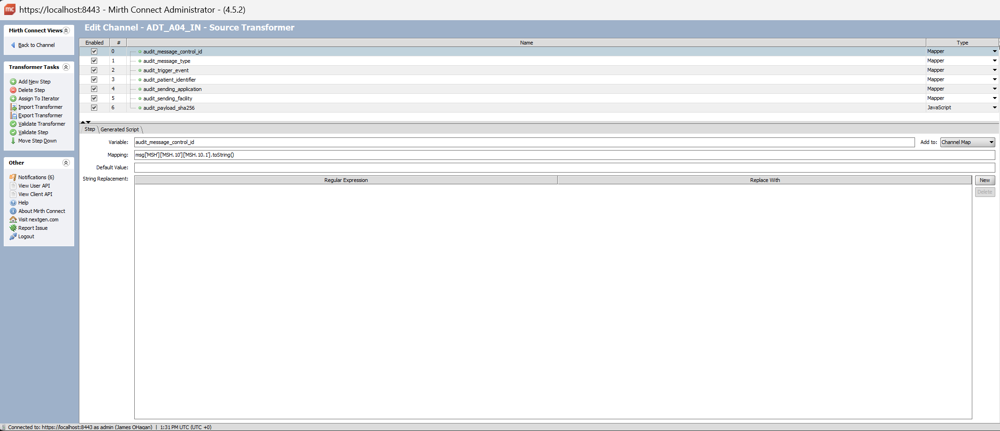
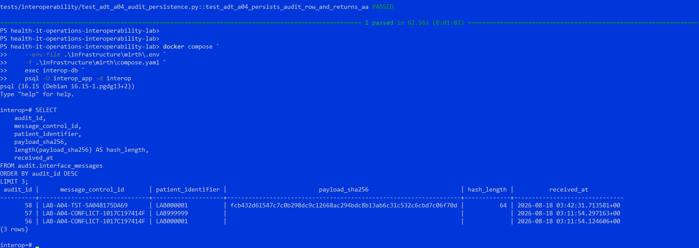
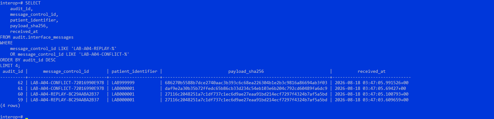
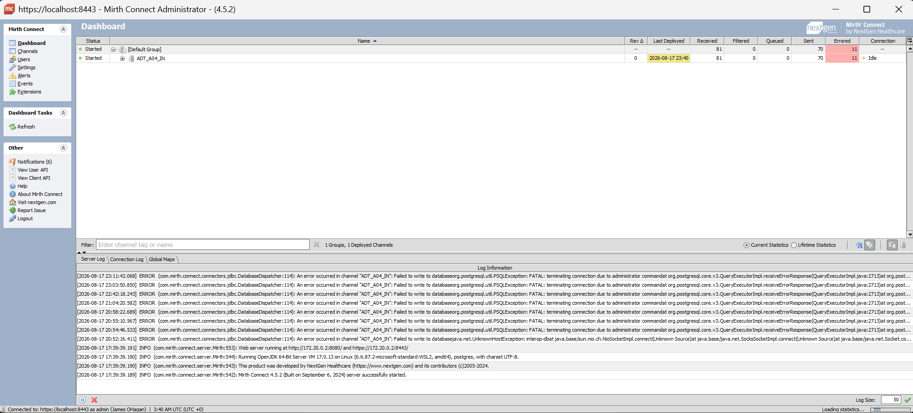

@'
# HL7 Replay, Message Identity, and Payload Integrity Validation

## Purpose

This validation exercise examines how an HL7 v2 interface behaves when the same message identity is delivered more than once.

The test scenarios distinguish between:

- an exact replay of the same HL7 transaction
- conflicting reuse of the same HL7 message control ID
- individual message receipt attempts
- logical transaction identity
- clinical/business identity
- payload identity

The validation deliberately establishes current behavior before introducing idempotency controls.

All patient identifiers and message content used in this lab are synthetic.

---

## System Under Test

The validation path is:

    Synthetic HL7 ADT^A04
            |
            v
           MLLP
            |
            v
       Mirth Connect
            |
            +--> HL7 field extraction
            |
            +--> SHA-256 payload fingerprint
            |
            v
       PostgreSQL
    audit.interface_messages
            |
            v
    pytest + direct SQL validation

Primary components:

- HL7 v2.5.1
- ADT^A04 registration message
- Mirth Connect 4.5.2
- MLLP transport
- PostgreSQL 16
- Python / pytest
- Docker Compose

---

## Identity Concepts

A central objective of this validation is to avoid treating all forms of identity as equivalent.

### Audit Identity

`audit_id` identifies an individual receipt event in PostgreSQL.

Each message delivery may legitimately produce a separate audit event even when the underlying HL7 transaction has already been received.

### Message Identity

The current logical HL7 message identity is represented by:

    MSH-3  Sending Application
    MSH-4  Sending Facility
    MSH-10 Message Control ID

For the synthetic lab source:

    Sending Application: LABSENDER
    Sending Facility:    INTEROPLAB

### Payload Identity

A SHA-256 digest is generated from the inbound HL7 payload.

This gives the interface a deterministic content fingerprint that allows two messages using the same HL7 message identity to be compared objectively.

### Clinical / Business Identity

For the current ADT scenario, PID-3 carries patient identification information.

Example synthetic identifiers:

    LAB000001
    LAB999999

The patient identifier is intentionally treated separately from MSH-10.

A patient may participate in many legitimate HL7 transactions, each having a different message control ID.

---

## Baseline Scenario 1 - Exact Replay

The automated test:

    test_duplicate_adt_a04_replay_currently_persists_twice

creates a unique ADT^A04 message and transmits the exact same MLLP frame twice.

The following remain identical:

    Sending Application
    Sending Facility
    MSH-10
    PID-3
    Entire HL7 payload

### Observed Current Behavior

    First delivery
        -> AA
        -> persisted

    Second delivery
        -> AA
        -> persisted again

Before idempotency controls are introduced, the current Database Writer therefore creates two audit rows for the same logical HL7 transaction.

After SHA-256 instrumentation was added, both receipt rows also contain the same payload fingerprint.

This allows the second receipt to be classified objectively as:

    EXACT REPLAY
    =
    same message identity
    +
    same payload identity

---

## Baseline Scenario 2 - Conflicting Message Identity

The automated test:

    test_same_message_control_id_with_different_patient_is_currently_accepted

creates a unique HL7 message and transmits it successfully.

A second transaction then deliberately retains the same MSH-10 while changing PID-3.

Example:

    First delivery

    MSH-10 = same message control ID
    PID-3  = LAB000001

    Second delivery

    MSH-10 = same message control ID
    PID-3  = LAB999999

### Observed Current Behavior

Both messages currently receive:

    AA

and both are persisted.

After payload fingerprinting was enabled, the two messages produce different SHA-256 values.

This allows the condition to be classified objectively as:

    CONFLICTING MESSAGE REUSE
    =
    same message identity
    +
    different payload identity

This is materially different from an exact retransmission.

---

## SHA-256 Payload Fingerprinting

The Mirth source transformer was enhanced with a JavaScript step named:

    audit_payload_sha256

The transformer calculates a SHA-256 digest from the inbound HL7 payload and stores it in the Mirth channel map.

The Database Writer then persists the value into PostgreSQL.

A schema migration added:

    ALTER TABLE audit.interface_messages
        ADD COLUMN IF NOT EXISTS payload_sha256 VARCHAR(64);

A composite lookup index was also added:

    CREATE INDEX IF NOT EXISTS
        idx_interface_messages_message_identity
    ON audit.interface_messages (
        sending_application,
        sending_facility,
        message_control_id
    );

The index improves lookup by logical message identity but deliberately does not enforce uniqueness.

The current `interface_messages` table represents receipt/audit history, and multiple delivery attempts must remain observable.

---

## Source-to-Target Data Lineage Validation

The validation traces transaction data across system boundaries rather than relying solely on transport success.

Current mappings include:

    HL7 source                   PostgreSQL audit target

    MSH-10        ------------>  message_control_id
    MSH-9.1       ------------>  message_type
    MSH-9.2       ------------>  trigger_event
    PID-3.1       ------------>  patient_identifier
    MSH-3         ------------>  sending_application
    MSH-4         ------------>  sending_facility
    HL7 payload   ------------>  payload_sha256

The validation path is therefore:

    source HL7
        |
        v
    interface transformation
        |
        v
    payload instrumentation
        |
        v
    database persistence
        |
        v
    direct SQL reconciliation

This is **source-to-target data lineage validation**.

A successful HL7 acknowledgment alone is not considered sufficient evidence that the expected state was persisted correctly.

---

## Exact Replay Versus Conflicting Reuse

SHA-256 instrumentation makes the distinction explicit.

### Exact Replay

    same sender
    same facility
    same MSH-10
    same SHA-256

    =
    exact replay

### Conflicting Reuse

    same sender
    same facility
    same MSH-10
    different SHA-256

    =
    message identity conflict

This distinction is important because retransmission can occur during normal failure and retry scenarios.

For example:

    sender transmits message
            |
            v
    receiver processes successfully
            |
            v
        ACK is lost
            |
            v
      sender retransmits

A reliable interface should be able to recognize that retransmission without repeating an incorrect downstream business effect.

Conflicting content under the same message identity represents a different integrity condition and should not silently be treated as an ordinary replay.

---

## Relationship to Failure and Recovery Testing

This validation extends the existing downstream reliability work documented in:

    docs/validation/03-hl7-mirth-audit-reliability-validation.md

The existing failure/recovery test deliberately stops the downstream PostgreSQL audit database while Mirth remains operational.

That validation proved:

- downstream persistence failure produces an HL7 AE
- MSA-2 remains correlated with the inbound MSH-10
- failed transactions are not falsely recorded as persisted
- PostgreSQL recovery is determined using actual Docker health status
- message processing resumes successfully after database recovery
- Mirth itself does not require restart for recovery

Replay testing adds another important question:

    What happens when a sender retries after uncertainty or failure?

---

## Secure Configuration Management

The running Mirth Database Writer requires a local PostgreSQL credential.

Before the channel configuration was exported into source control, the local password was replaced with:

    REPLACE_WITH_LOCAL_SECRET

No runtime credential is intentionally stored in Git.

---

## Current Engineering Findings

The current pre-idempotency implementation demonstrates that:

1. A successful HL7 AA does not prove correct duplicate-handling semantics.
2. Exact retransmission currently creates another persisted receipt.
3. The same MSH-10 can currently be reused with different clinical content.
4. Payload fingerprints can distinguish exact replay from conflicting reuse.
5. MSH-10 identifies an HL7 message instance and must not be confused with patient or other healthcare business identifiers.
6. Receipt/audit history and logical business processing are separate concerns.
7. Source-to-target reconciliation provides stronger evidence than checking interface transport alone.

---

## Intended Next Contract

The next implementation phase will move from observing current behavior to enforcing and testing a deliberate transaction-integrity contract.

### First Delivery

    message identity not previously seen

    -> process normally
    -> create logical transaction
    -> record receipt attempt
    -> AA

### Exact Replay

    same message identity
    +
    same SHA-256

    -> identify replay
    -> do not repeat logical business effect
    -> retain receipt-attempt evidence
    -> AA

### Conflicting Reuse

    same message identity
    +
    different SHA-256

    -> identify integrity conflict
    -> do not silently overwrite or process
    -> preserve evidence
    -> return visible failure or quarantine condition

### Legitimate Later Update

    new MSH-10
    +
    same healthcare business identifier
    +
    new state

    -> treat as a new transaction acting on the same business object

Later validation will also examine stale and out-of-order updates.

---

## Longer-Term Direction

This transaction-integrity model will become part of a broader healthcare interoperability quality-engineering workflow:

    HL7 v2
        |
        v
      Mirth
        |
        v
    patient identity evaluation
        |
        v
    HL7-to-FHIR mapping
        |
        v
    SMART / OAuth
        |
        v
    OpenEMR FHIR API
        |
        v
    FHIR retrieval
        |
        v
    source-to-target reconciliation

Future scenarios will include:

- patient identifier assigning authority
- duplicate patient records
- demographic changes
- ambiguous patient identity
- FHIR Patient search and matching
- legitimate updates
- stale and out-of-order updates
- retry behavior
- downstream service failure
- authorization failure
- FHIR profile and conformance validation

---

## Engineering Direction

The long-term objective of this lab is not simply to accumulate interoperability technologies.

The specialization is healthcare interoperability quality engineering with particular emphasis on:

- patient identity
- transaction integrity
- source-to-target data lineage
- HL7 and FHIR semantic fidelity
- persistence validation
- failure and recovery behavior
- deterministic automated testing

The goal is to validate not merely whether healthcare information was transmitted, but whether it arrived at the correct destination, retained its intended meaning, created the correct persisted state, and behaved safely under retry, replay, failure, recovery, and conflicting-data conditions.
'@ | Set-Content `
    .\docs\validation\04-hl7-replay-payload-integrity-validation.md `
    -Encoding UTF8

Write-Host ""
Write-Host "Created:"
Write-Host "docs\validation\04-hl7-replay-payload-integrity-validation.md"
Write-Host ""

git status
git diff --check
git diff --stat

Write-Host ""
Write-Host "First 35 lines:"
Get-Content `
    .\docs\validation\04-hl7-replay-payload-integrity-validation.md `
    -Head 35
---

## Validation Evidence

The following screenshots provide visual evidence of the transaction-integrity
and payload-fingerprinting work described above.

### Mirth SHA-256 Payload Transformer

The Mirth `ADT_A04_IN` source transformer includes the `audit_payload_sha256`
JavaScript step alongside the existing HL7 field-mapping steps.

This instrumentation calculates a SHA-256 fingerprint from the inbound HL7
payload before downstream persistence.

### PostgreSQL Payload Fingerprint Persistence

A successfully processed synthetic ADT transaction was queried directly from
PostgreSQL after SHA-256 instrumentation was enabled.

The persisted `payload_sha256` value was verified to contain 64 hexadecimal
characters, confirming successful source-to-target persistence of the SHA-256
digest.

### Exact Replay Versus Conflicting Reuse

Direct SQL validation demonstrates two distinct conditions.

For the exact replay:

    same MSH-10
    same patient identifier
    same SHA-256

For the conflicting reuse scenario:

    same MSH-10
    different patient identifier
    different SHA-256

The evidence demonstrates that payload fingerprinting can objectively
distinguish an exact retransmission from conflicting content using the same
HL7 message identity.

### Controlled Downstream Failure Evidence

The Mirth operational dashboard also captured expected Database Writer errors
during deliberate PostgreSQL dependency interruption.

These errors were generated during controlled failure-injection testing and
are retained as evidence that downstream persistence failure was visible to
the interface rather than being silently reported as successful processing.

---

## Evidence Summary

The validation uses evidence from multiple layers:

    Automated test evidence
        pytest assertions and controlled test scenarios

    Interface evidence
        Mirth transformer configuration and ACK behavior

    Persistence evidence
        direct PostgreSQL source-to-target reconciliation

    Operational evidence
        Mirth Database Writer failure and recovery observations

Together these provide stronger assurance than relying on any single layer
such as an HL7 acknowledgment, application log, or database row alone.
