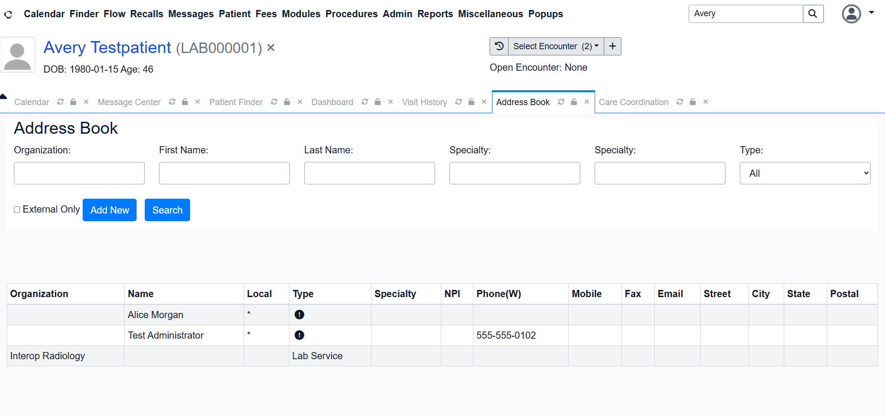
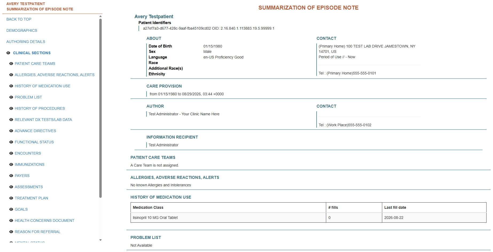

# C-CDA Source-Data Conformance Investigation

## Objective

Validate an OpenEMR-generated C-CDA document using a Schematron validation service, investigate reported conformance failures, trace those failures back through the generated XML and application data, and verify remediation through controlled regeneration and revalidation.

The investigation was designed to distinguish between:

- XML well-formedness
- C-CDA structural and semantic conformance
- source-data completeness
- transformation behavior
- application defects

The goal was not simply to obtain a passing validation result, but to identify the layer responsible for each reported failure and verify the diagnosis through controlled changes.

## Environment

- OpenEMR: 8.2.x lab environment
- C-CDA generation path: OpenEMR Care Coordination
- Validation service: OpenEMR-bundled `oe-schematron-service`
- Schematron rules file: `Consolidation.sch`
- Test patient: synthetic
- Test provider/author data: synthetic
- XML inspection: Python with namespace-aware XPath
- Automated contracts: Python / Pytest
- Transformation testing: XSLT with `lxml`

All patient, provider, telephone, address, and other identifying values used in this investigation are synthetic lab data.

## Investigation Summary

The initial OpenEMR-generated C-CDA document was XML well-formed and renderable, but Schematron validation returned 12 errors.

The errors were not assumed to represent application defects.

Instead, each finding was correlated with the relevant generated XML and then traced back toward the corresponding OpenEMR source data.

Controlled source-data changes were made through the application, followed by regeneration of the C-CDA document and validation using the same Schematron service and ruleset.

The validation progression was:

- Baseline incomplete source data: **12 errors**
- Patient demographics and author identity completed: **2 errors**
- Author work phone completed: **0 errors**

This progression allowed the original validation findings to be attributed to specific source-data conditions rather than assumed generator defects.

## Baseline Validation

Baseline artifact:

`tests/ccda/fixtures/avery-testpatient-incomplete-demographics.xml`

Validator evidence:

`tests/ccda/fixtures/avery-testpatient-incomplete-demographics-validation.json`

Validation result:

- Errors: 12
- Warnings: 0
- Ignored: 3

The reported findings included:

- missing patient street address
- missing patient city
- missing patient state
- missing patient postal code
- missing patient telecom
- incomplete author/information-recipient name representation
- missing `assignedAuthor` telecom

Inspection of the generated XML confirmed that the corresponding values were absent or incomplete.

Source-data inspection then showed that the associated OpenEMR patient and user fields were also incomplete.

This supported the hypothesis that the findings could originate from source-data completeness rather than from a failure of the C-CDA generator to transform populated source fields.

## Controlled Remediation 1

The first experiment changed the source application data while leaving the validation process unchanged.

### Patient

The synthetic patient's demographic information was completed through OpenEMR:

- Street: `100 TEST LAB DRIVE`
- City: `JAMESTOWN`
- State: `NY`
- Postal code: `14701`
- Home phone: `555-555-0101`

### Author

The synthetic author identity was completed as:

- First name: `Test`
- Last name: `Administrator`

A new C-CDA document was then generated.

Artifact:

`examples/ccda/avery-testpatient-complete-demographics.xml`

Validator evidence:

`tests/ccda/fixtures/avery-testpatient-complete-demographics-validation.json`

Validation result:

- Errors: 2
- Warnings: 0
- Ignored: 3

Ten of the original twelve errors disappeared after completing the corresponding source data.

The two remaining errors were both associated with:

`CONF:1198-5428`

The validator reported that `assignedAuthor` did not contain the required telecom information.

This reduced the investigation from a broad collection of document findings to one specific remaining data path.

## Root-Cause Trace

The remaining `assignedAuthor` telecom finding was traced backward through the OpenEMR C-CDA generation path.

The document-header author is selected by:

`EncounterccdadispatchTable::getDocumentAuthorRecord()`

The observed author-selection precedence in the inspected OpenEMR implementation was:

1. configured `hie_author_id`
2. current session `authUserID`
3. patient provider
4. configured `hie_primary_care_provider_id`

Database inspection found no configured `hie_author_id` or `hie_primary_care_provider_id` value for the Care Coordination module.

The current session therefore supplied the document author.

The resolved user was:

- User ID: `1`
- Username: `admin`
- First name: `Test`
- Last name: `Administrator`

Database inspection showed:

`users.phonew1 = NULL`

Further source inspection established that the C-CDA generation path obtains the author work telephone from `phonew1`.

The relevant source-to-document path was traced as:

```text
OpenEMR Address Book
        |
        v
users.phonew1
        |
        v
getDetails()
        |
        v
getAuthor()
        |
        v
<author><telecom>
        |
        v
C-CDA service request model
        |
        v
Node C-CDA generation
        |
        v
all.author.telecom
        |
        v
ClinicalDocument
/author/assignedAuthor/telecom
```

The OpenEMR Address Book UI was then identified as the application-level interface that maintains `users.phonew1`.

This was important because the normal Admin user-edit screen did not expose the work-phone field, while the Address Book did.

## Controlled Remediation 2

The existing synthetic `Test Administrator` Address Book entry was edited through OpenEMR.

The Work Phone value was set to:

`555-555-0102`

No direct database modification was used for the remediation.

Database verification after the UI change confirmed:

`users.phonew1 = 555-555-0102`

A third C-CDA document was then generated.

Artifact:

`examples/ccda/avery-testpatient-complete-author-telecom.xml`

Raw namespace-aware XML inspection confirmed that the structured document now contained:

```xml
<telecom value="tel:555-555-0102" use="WP"/>
```

This established that the source value propagated beyond the application UI and database into the structured C-CDA representation.

The new document was then submitted to the same Schematron validation service and ruleset used for the previous experiments.

Validator evidence:

`tests/ccda/fixtures/avery-testpatient-complete-author-telecom-validation.json`

Final validation result:

- Errors: 0
- Warnings: 0
- Ignored: 3

The result matched the prediction made before the final source-data change: resolving the missing author work-phone source value eliminated the two remaining `assignedAuthor` telecom findings.

## Evidence Highlights

### Source Application Data

The OpenEMR Address Book was used to populate the synthetic document author's Work Phone field.



### Generated Clinical Document

After regeneration, the rendered C-CDA displayed the synthetic author's work telephone number.



### Raw XML Verification

Namespace-aware inspection of the generated document confirmed that the telephone number was represented as structured C-CDA data rather than appearing only in rendered narrative content.


### Schematron Validation

The regenerated document was submitted to the same identified Schematron validation service used throughout the controlled investigation.


## Results

| Stage | Errors | Warnings | Ignored |
|---|---:|---:|---:|
| Baseline incomplete source data | 12 | 0 | 3 |
| Patient demographics and author identity completed | 2 | 0 | 3 |
| Author work phone completed | 0 | 0 | 3 |

The controlled progression was therefore:

```text
12 errors
    |
    | complete patient demographics,
    | patient telecom and author identity
    v
2 errors
    |
    | trace assignedAuthor telecom to users.phonew1
    | and populate Work Phone through OpenEMR
    v
0 errors
```

## Validator Provenance

The local validation service used the OpenEMR-bundled `Consolidation.sch` Schematron ruleset.

Inspection of the rules file identified the following generation metadata:

`Schematron generated from Trifolia on 7/20/2021`

The exact `Consolidation.sch` file used during this investigation produced the following SHA-256 digest:

`1b88ad26148ae593e3cdcb7bdc0caf46f36db1e0e4735b113abf4cb73c5a68ea`

Recording the ruleset identity and cryptographic digest provides reproducible evidence of which local validation artifact produced the reported results.

The final result should not be interpreted as universal proof of complete C-CDA conformance. It demonstrates that the generated document produced zero reported errors and zero reported warnings under this identified Schematron validation path and its configured behavior.

## Automated Contract Testing

In addition to Schematron validation, the lab contains automated C-CDA tests covering selected structural, semantic, and transformation contracts.

The automated tests include checks for:

- XML parseability and `ClinicalDocument` identity
- expected synthetic patient identity
- medication coding and semantics
- RxNorm representation
- medication route coding
- medication dose
- expected encounters
- C-CDA section identification by LOINC
- section template identity
- template-version matching
- medication activity template identity
- negative-path medication route validation
- misleading human-readable section titles
- incorrect section LOINC codes
- XSLT transformation behavior
- preservation of clinical semantics through transformation
- deliberate semantic loss through a broken XSLT fixture

At the completion of this investigation:

```text
20 C-CDA tests passed
```

These tests are intended as selected runtime and semantic contracts for the controlled lab. They are not presented as a replacement for comprehensive standards validation.

## Conclusion

The original Schematron findings were attributable to incomplete source application data rather than demonstrated defects in the C-CDA generation process.

The investigation established a traceable relationship across:

- application UI data
- database persistence
- PHP C-CDA request construction
- Node-based C-CDA generation
- structured XML
- human-readable C-CDA rendering
- Schematron validation results

The investigation also demonstrated why a validation failure should not automatically be classified as an application defect.

The initial document contained twelve reported errors, but controlled investigation showed that the corresponding source fields were incomplete. Completing those fields through the application caused the expected findings to disappear without modifying the C-CDA generator or validator.

The final generated document produced:

- 0 reported errors
- 0 reported warnings
- 3 ignored findings

under the identified OpenEMR-bundled `Consolidation.sch` validation path.

## Engineering Lessons

1. **XML well-formedness does not imply C-CDA conformance.**

   A document can parse successfully while violating structural or semantic requirements.

2. **A validator failure does not automatically indicate a software defect.**

   The failure may originate from incomplete source data, configuration, transformation logic, terminology, or another upstream dependency.

3. **Source-data completeness can determine downstream interoperability conformance.**

   Required information cannot be represented correctly downstream when the authoritative source value is absent.

4. **Human-readable rendering is not sufficient evidence of structured interoperability.**

   Values visible in rendered HTML should also be verified in the underlying structured XML when downstream systems depend on coded or structured content.

5. **Application UI, database state, transformation code, generated XML, and validator output should be correlated before assigning root cause.**

   No single representation should automatically be treated as sufficient evidence.

6. **Controlled changes produce stronger diagnostic evidence.**

   Changing known source variables and rerunning the same validation process makes cause-and-effect substantially easier to establish.

7. **Validator provenance matters.**

   A passing result should identify the ruleset and validation path that produced it rather than being generalized into an unsupported claim of universal compliance.

8. **Standards conformance and source-to-document reconciliation answer different questions.**

   A standards validator can determine whether a representation satisfies its rules, while reconciliation determines whether the representation contains the correct clinical information from the source system.

## Evidence Artifacts

### Generated C-CDA Documents

- `tests/ccda/fixtures/avery-testpatient-incomplete-demographics.xml`
- `examples/ccda/avery-testpatient-complete-demographics.xml`
- `examples/ccda/avery-testpatient-complete-author-telecom.xml`

### Schematron Results

- `tests/ccda/fixtures/avery-testpatient-incomplete-demographics-validation.json`
- `tests/ccda/fixtures/avery-testpatient-complete-demographics-validation.json`
- `tests/ccda/fixtures/avery-testpatient-complete-author-telecom-validation.json`

### Inspection and Validation Utilities

- `scripts/ccda/inspect_ccda.py`
- `scripts/ccda/list_sections.py`
- `scripts/ccda/extract_section.py`
- `scripts/ccda/inspect_medication_entries.py`
- `scripts/ccda/inspect_validation_findings.py`
- `scripts/ccda/summarize_schematron.py`
- `scripts/ccda/validate_ccda.py`

### Transformation Artifacts

- `examples/ccda/ccda-summary.xsl`
- `examples/ccda/avery-testpatient-summary.html`
- `tests/ccda/fixtures/ccda-summary-broken.xsl`

### Visual Evidence

- `docs/validation/evidence/ccda/01-openemr-author-work-phone.png`
- `docs/validation/evidence/ccda/02-generated-ccda-author-telecom.png`
- `docs/validation/evidence/ccda/03-raw-ccda-author-telecom.png`
- `docs/validation/evidence/ccda/04-schematron-final-validation.png`
- `docs/validation/evidence/ccda/ccda-xslt-clinical-summary.png`