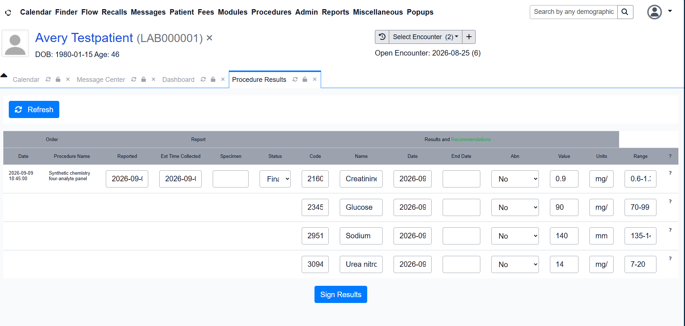

# ORU Multi-Analyte Panel Validation

## Objective

Extend the synthetic laboratory workflow from one observation per ORU message
to one ordered result group containing multiple observations, while preserving
validation, replay safety, transactional persistence, and guarded delivery to
OpenEMR.

## Test Scenario

The deterministic `SYN-CHEM-4` fixture contains one `OBR` and four `OBX`
segments:

| Sequence | LOINC | Analyte | Value | Units | Reference range |
|---:|---|---|---:|---|---|
| 1 | `2345-7` | Glucose | 90 | mg/dL | 70-99 |
| 2 | `3094-0` | Urea nitrogen | 14 | mg/dL | 7-20 |
| 3 | `2160-0` | Creatinine | 0.9 | mg/dL | 0.6-1.3 |
| 4 | `2951-2` | Sodium | 140 | mmol/L | 135-145 |

Message control ID: `SCENARIO-ORU-PANEL-001`.

## Implementation

- The scenario builder accepts plural observations and emits sequential OBX
  segments while retaining the guarded legacy singular form.
- The Mirth channel collects, validates, and serializes every OBX in the
  ordered observation group.
- Migration `023-oru-result-groups.sql` adds explicit result-group ownership,
  observation sequence, and original OBX set identifiers.
- Mirth persists the message, group, and observations in one transaction.
- The OpenEMR delivery worker aggregates every observation in canonical order
  instead of selecting one row with `LIMIT 1`.
- The OpenEMR receiver requires the committed result count to equal the number
  of transmitted OBX segments.

## Runtime Investigation

### Failure 1: stale scalar variable

The first live panel reached Mirth but returned `AE` because an operator trace
still referenced the retired scalar `obxResultStatus`. The source transformer
failed before publishing validation state, so neither persistence destination
ran. The postprocessor correctly refused to return success when validation
state was unavailable.

Remediation: the trace now reads `firstObservation.result_status`, and a
regression contract prohibits the retired identifier.

### Failure 2: prepared-statement type mismatch

The repaired replay passed validation but PostgreSQL rejected the observation
insert because `observation_sequence` is an integer while the bound Mirth
parameter was inferred as character varying. The explicit transaction rollback
kept canonical counts unchanged and prevented a partial message/group graph.

Remediation: the SQL placeholder is explicitly cast with
`CAST(? AS INTEGER)`, with regression coverage for the required cast.

### Downstream cardinality gap

The original OpenEMR worker selected the first observation with `LIMIT 1` and
hardcoded `result_count` to one. This was valid for the original Glucose-only
exercise but incompatible with panels.

Remediation: the worker now aggregates ordered observations as JSON, creates a
plural scenario, and records dynamic cardinality. The receiver timestamps all
OBX segments and verifies exactly one new report and the expected number of new
result rows.

## Runtime Evidence



*OpenEMR Procedure Results displaying one synthetic HL7 ORU panel as one
report with four analyte results. All patient and clinical data are synthetic.*

The corrected replay returned:

```text
MSA|AA|SCENARIO-ORU-PANEL-001|Message accepted.
```

Canonical interoperability state:

| Evidence | Result |
|---|---:|
| ORU message ID | 155 |
| Result groups | 1 |
| Observations | 4 |
| Minimum sequence | 1 |
| Maximum sequence | 4 |
| Ownership violations | 0 |

Guarded OpenEMR delivery state:

| Evidence | Result |
|---|---|
| Delivery ID | 11 |
| OpenEMR order ID | 106 |
| Status | `DELIVERED` |
| Attempts | 1 |
| Reports | 1 |
| Results | 4 |
| Last error | none |

OpenEMR displayed a single Synthetic chemistry four-analyte panel with all four
values. The report initially remained in the normal `received` review state,
available through the pending-review workflow before clinical signing.

## Verification

The feature regression set completed with 50 passing tests. Additional checks
confirmed valid Mirth XML, successful Python compilation, valid PHP syntax in
the OpenEMR container, and a clean `git diff --check` apart from expected local
LF-to-CRLF conversion warnings.

## Result

The laboratory workflow now preserves panel cardinality across HL7 transport,
Mirth validation, transactional audit persistence, replay recovery, downstream
delivery, OpenEMR parsing, and clinical application display.
